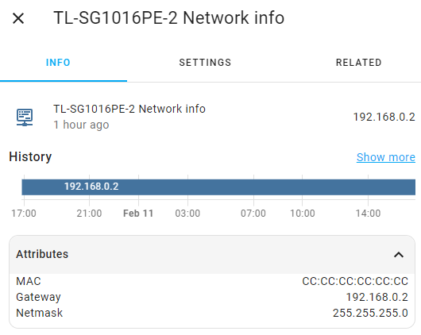
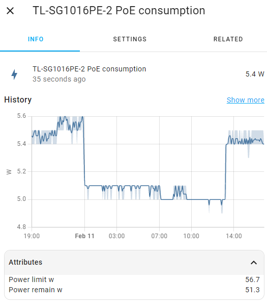
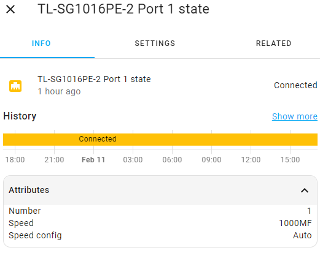
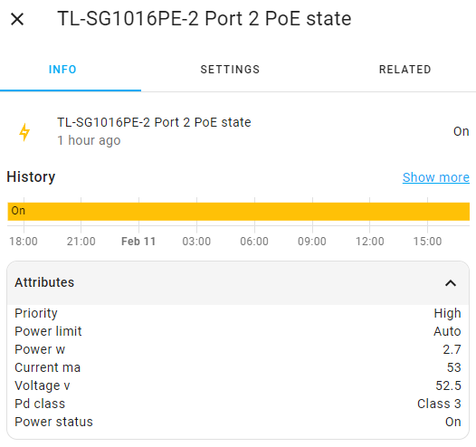

# Sensors

## Network information

The component allows you to get the network information of the switch. 
The sensor value is the IP address of the switch.

There is one sensor that is always present:
* `sensor.<integration_name>_network_info`

The sensor exposes the following attributes:

|     Attribute     |          Description          |
|-------------------|-------------------------------|
| `mac`             | The MAC address or the switch |
| `gateway`         | Default gateway               |
| `netmask`         | Subnet mask                   |

## PoE consumption

The component allows you to get the PoE information of the switch. 
The sensor value is the actual PoE consumption of the switch in watts.

There is one sensor that is always present:
* `sensor.<integration_name>_poe_consumption`

The sensor exposes the following attributes:

|     Attribute     |                 Description                  |
|-------------------|----------------------------------------------|
| `power_limit_w`   | The actual PoE limit                         |
| `power_remain_w`  | Remaining power until the limit is exhausted |

## Port status

The component allows you to get the status of each port.

There are several sensors that are always present:
* `binary_sensor.<integration_name>_port_<port_number>_state`

Each sensor exposes the following attributes:

|     Attribute        |          Description         |
|----------------------|------------------------------|
| `number`             | The number of the port       |
| `speed`              | Actual connection speed*     |
| `speed_config`       | Configured connection speed* |

\* the connection speed is represented by the following values:

|    Value    |        Description        |
|-------------|---------------------------|
| `Link Down` | The link is down          |
| `Auto`      | Automatic speed selection |
| `10MH`      | 10 Mbps, half-duplex      |
| `10MF`      | 10 Mbps, full duplex      |
| `100MH`     | 100 Mbps, half-duplex     |
| `100MF`     | 100 Mbps, full duplex     |
| `1000MF`    | 1000 Mbps, full duplex    |

_Note: The sensor will be unavailable if the port is not enabled (see [port state switch](controls.md#port-state-switch))._
| `power_remain_w`  | Remaining power until the limit is exhausted |

## Port PoE status

The component allows you to get the PoE status of each port.

There are several sensors that are always present:
* `binary_sensor.<integration_name>_port_<port_number>_poe_state`

Each sensor exposes the following attributes:

|     Attribute        |                   Description                  |
|----------------------|------------------------------------------------|
| `priority`           | Port power priority in case of power shortage* |
| `power_limit`        | Power consumption limit**                      |
| `power_w`            | Actual power consumption in watts              |
| `current_ma`         | Actual current in milliamps                    |
| `voltage_v`          | Actual voltage in volts                        |
| `pd_class`           | Actual power delivery class***                 |
| `power_status`       | Actual PoE status****                          |

**\*** the priority is represented by the following values:
* `High`
* `Middle`
* `Low`

**\*\*** if the power consumption limit is set manually, it will be displayed as a number. In other cases, it will be represented by one of the following values:
* `Auto`
* `Class 1`
* `Class 2`
* `Class 3`
* `Class 4`

**\*\*\*** the power delivery class is represented by the following values:
* `Class 0`
* `Class 1`
* `Class 2`
* `Class 3`
* `Class 4`

**\*\*\*\*** the power status is represented by the following values:
* `On`
* `Off`
* `Turning on`
* `Overload`
* `Short`
* `Non-standard PD`
* `Voltage high`
* `Voltage low`
* `Hardware fault`
* `Overtemperature`

_Note: The sensor will be unavailable if the port PoE is not enabled (see [port PoE state switch](controls.md#port-poe-state-switch))._